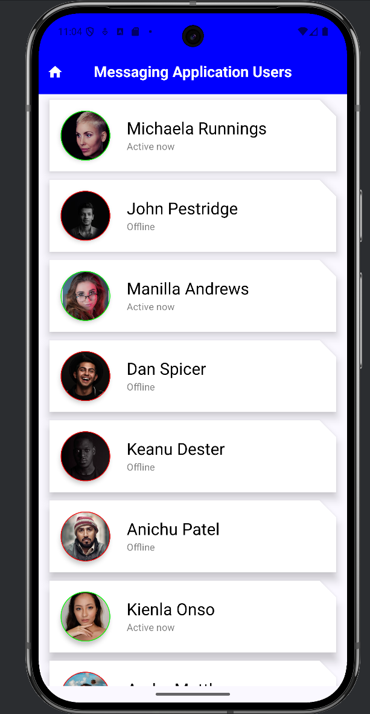
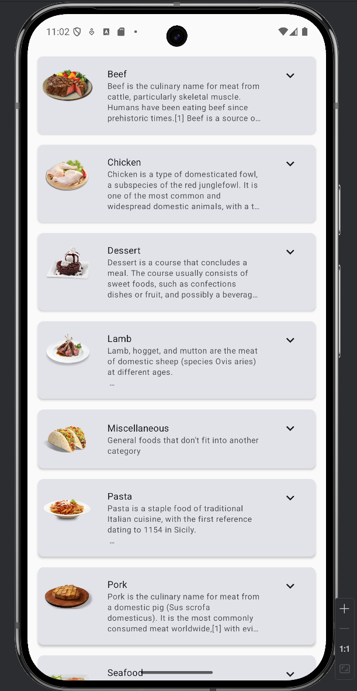

# Frontend Mobile

A collection of two projects built using **Kotlin** and **Jetpack Compose** to practice modern Android development techniques, including UI design, state management, animations, and API integration.

---

## Table of Contents

1. [Introduction](#introduction)
2. [Projects Overview](#projects-overview)
3. [Technologies Used](#technologies-used)
4. [Getting Started](#getting-started)
5. [How to Run Each Project](#how-to-run-each-project)
6. [Project Details](#project-details)
   - [Project 1: Messaging App](#project-1-messaging-app)
   - [Project 2: Mealz App](#project-2-mealz-app)
7. [Contributing](#contributing)
8. [License](#license)
9. [Acknowledgments](#acknowledgments)

---

## Introduction

This repository contains two Android applications developed using **Kotlin** and **Jetpack Compose**. These projects focus on UI design, state management, animations, and API integration, providing hands-on experience in building modern Android applications.

---

## Projects Overview

Here is a brief overview of each project:

- **Messaging App** - A simple interface displaying users loaded from disk with smooth scrolling and lazy column implementation.
- **Mealz App** - A meal listing app that fetches meals from the **MealsDB API**, featuring **navigation** and **animations**.

---

## Technologies Used

- **Kotlin**
- **Jetpack Compose**
- **Coroutines & Flow**
- **Retrofit** (for API calls)
- **Room Database** (if applicable)
- **Navigation Component**
- **LazyColumn for efficient lists**
- **Material Design Components**

---

## Getting Started

To run these projects, you need:

- **Android Studio Flamingo or newer**
- **A device or emulator running Android 7.0 (API 24) or later**
- **An internet connection (for Mealz App)**

---

## How to Run Each Project

Each project is contained in its own directory. Open the project in **Android Studio**, build the project, and run it on an emulator or a physical device.

---

## Project Details

### Project 1: Messaging App

- **Description:** A user-friendly messaging interface displaying a list of users loaded from a local file.
- **Features:**
  - Displays user profiles in a **LazyColumn** for optimized scrolling.
  - Loads user data from disk.
  - Clean and modern UI using **Material Design**.
- **Concepts Practiced:** **LazyColumn, state management, UI composition, and local data handling.**

---

### Project 2: Mealz App

- **Description:** A meal browsing application that fetches meal data from the **MealsDB API**.
- **Features:**
  - Fetches meals dynamically from a REST API using **Retrofit**.
  - Smooth navigation between meal details using **Jetpack Navigation**.
  - Beautiful UI with animations for an engaging user experience.
- **Concepts Practiced:** **API calls, navigation, animations, and UI composition with Jetpack Compose.**

---

## Contributing

Contributions, issues, and feature requests are welcome!

Feel free to check the [issues page](#). If you would like to contribute, please fork the repository and make changes as you'd like.

---

## License

This project is licensed under the MIT License - see the [LICENSE](LICENSE) file for details.

---

## Acknowledgments

- Special thanks to **Catalin Ghita** for his excellent [Jetpack Compose Masterclass](https://www.udemy.com/course/jetpack-compose-masterclass/) on Udemy, which greatly contributed to the knowledge and skills used in these projects.
- Thanks to the **Android development community** for resources, inspiration, and best practices.